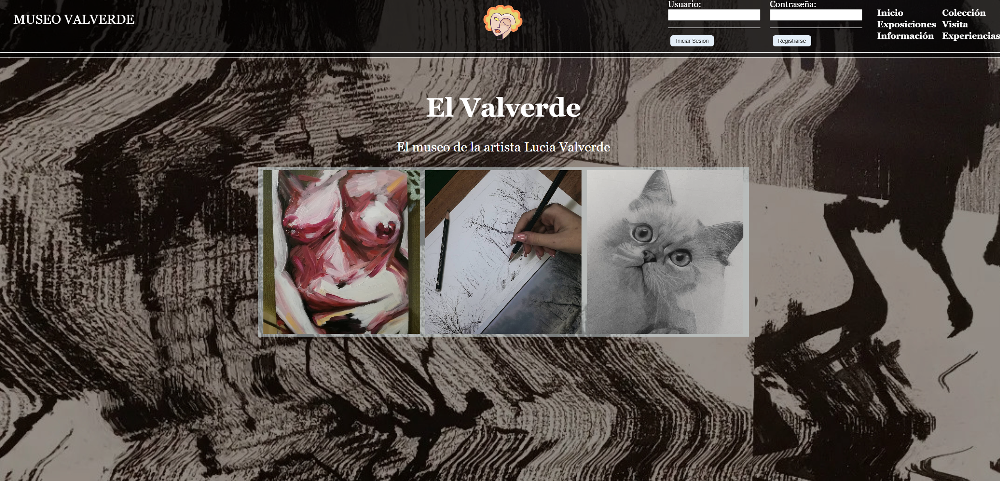

# MuseoValverde 

Este proyecto es una práctica desarrollada en la asignatura de Programación Web. Se basa en la creación de la página web de un museo. Las obras se almacenan en una base de datos que no está incluida en este repositorio. Además, se incluye un archivo PDF que describe cómo se creó el proyecto.


## Descripción

El objetivo de este proyecto es diseñar y desarrollar una página web para un museo. La página incluye características como la visualización de obras de arte almacenadas en una base de datos, y un video demostrativo del funcionamiento del sitio.


## Misión

La misión de este proyecto, aparte de proporcionar un ejemplo de cómo se podría realizar una página web, es sobre todo mostrar los proyectos grandes que he ido haciendo en la carrera, tanto este como otros que hay en mi perfil.

## Base de Datos

Nota: La base de datos que contiene las obras no está incluida en este proyecto. Para utilizar el proyecto, es necesario configurar una base de datos compatible y cargar los datos de las obras manualmente o a través de la interfaz de administrador incorporada en el proyecto.

## Documentación

El archivo PDF que detalla cómo se creó este proyecto está incluido en el repositorio. Puedes encontrarlo en la raíz del proyecto con el nombre `Como_se_hizo.pdf`. Pido de antemano perdón por si no hay mucha documentación en el proyecto debido al tiempo en la universidad, y posibles errores, lógicos o de eficiencia ya que todavía sigo aprendiendo a estructurar mejor.

## Aclaraciones y Derechos de Autor

Todas las obras y elementos que aparecen tanto en el video como en los archivos de imágenes presentan derechos de autor y la mayoría han sido eliminadas por respeto a la autora. También cabe destacar que tanto títulos, descripciones, etc. pertinentes en el proyecto son invención mía y no se corresponden con la realidad.

## Video Demostrativo

A continuación se muestra una miniatura del video demostrativo del museo. Haz clic en la imagen para ver el video en YouTube.

<p align="center">
  <a href="https://www.youtube.com/watch?v=ckTeKfZTYe4">
    
  </a>
</p>

## Licencia

```plaintext
All Rights Reserved
Copyright (c) 2024 Willy

Unauthorized copying of this file, via any medium is strictly prohibited.
Proprietary and confidential.

Written by Wistry, 2024.
